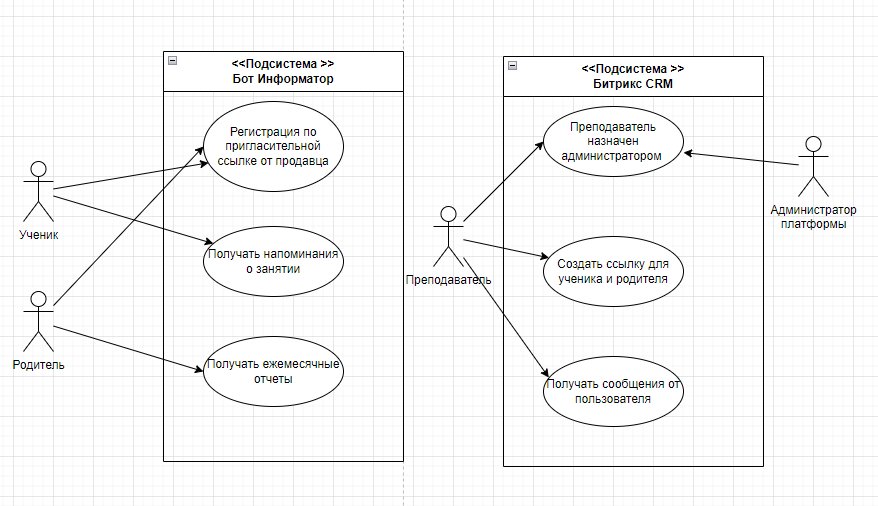

# Бот Информатор

## Содержание
1. [Введение](#Введение)
2. [Общее описание](#2--Общее-описание)
3. [Детальные требования](#3--Детальные-требования)
4. [Приложения]()
5. [Алфавитный указатель]()

## Введение
 
### 1.  Назначение

Требуется разработать систему для онлайн школы, целью которой будет являться уведомления родителей об успеваемости и напоминании для учеников подключиться к занятию.

Система должна состоять из Telegram бота, который будет выполнять функции информирования и взаимодействия с пользователями и интеграции с CRM

### 2. Область действия

Система разрабатывается для внутреннего использования в компании заказчика, применение за пределами невозможно.

## Общее описание

### 1.  Взаимодействие продукта 
<!--(с другими продуктами и компонентами) -->

Предстоит реализовать интеграцию с Битрикс CRM (используемой в компании) и реализовать подключение к БД клиентов компании.

### 2.  Функции продукта 
<!-- (краткое описание) -->
Требуется реализовать основные функции:
-  напоминания об оплате родителю
-  отправлять уведомления за 10 минут до начала занятия и получать подтверждение от ученика, либо причину по которой ученик вынужден пропустить занятие, чтобы преподаватель не ждал впустую

### 3.  Характеристики пользователя
Список всех представленных в системе пользователей:
-   Несколько типов пользователей бота Родитель и Ученик
-   Преподаватель получает присылаемые сообщения ботом в CRM

### 4.  Ограничения
 -   Специальных аппаратных и других ограничений не требует

## Детальные требования
<!-- (могут быть организованы по разному, н-р, так)  -->

### 1. Требования к внешним интерфейсам:
- ##### Интерфейсы пользователя
Представляет собой пользовательский интерфейс взаимодействия с телеграмм ботом состоящий из текстовых сообщений и различных видов кнопок

Со стороны преподавателя в качестве интерфейса для получения сообщений выступает Битрикс CRM 

- #####  Интерфейсы аппаратного обеспечения
 Пользователю требуется современный смартфон поддерживающий установку и работу в мессенджере Telegram

- ##### Интерфейсы программного обеспечения
Взаимодействие между ботом и Битрикс CRM осуществляется помощью API Битрикс CRM

- ##### Интерфейсы взаимодействия
Данная система реализует человеко-машинный интерфейс взаимодействия.

### 2. Функциональные требования
Требования по функционалу выглядят следующим образом:

- Бот должен присылать уведомление а 10 минут до начала занятия 
- Преподаватель должен получить подтверждение от ученика, либо причину по которой ученик вынужден пропустить занятие
- Бот должен на основе данных из БД отправлять отчет родителю о количестве проведенных/пропущенных занятий за месяц
- Бот должен напоминать родителю за неделю до окончания месяца об оплате в случае если родитель не оплатил ранее или не заплатил больше авансом

### 3. Требования к производительности
Бот и система размещаются на виртуальной машине, достаточно минимальной конфигурации, к примеру:
- OS Ubuntu/Debian
- CPU 1x2.4GHz
- RAM 512 Mb
- Disks: HDD 10 Gb

### 4.  Проектные ограничения 
<!-- (и ссылки на стандарты) -->
Проектные ограничения должны брать во внимания возможности и ограничения API Telegram и API Битрикс CRM

### 5.  Нефункциональные требования 
<!-- (надежность, доступность, безопасность и пр.) -->
-   требуется обеспечить высокую надежность и отказоустойчивость
-   система должна справлять со 100 запросами в минуту

### 6.  Оценка работы. 
<!-- (описать трудозатраты) -->
-   По предварительным оценкам сбор требований и проектирование системы не должно занять более 1-2х недель
	-   Разработка потребует 1-2х программистов и время на реализацию составит 1-2 недели рабочего времени.

## Приложения
P.s. здесь должны быть схемы и диаграммы

 \
рис. 1 UML Use Case (_Диаграмма вариантов использования_)